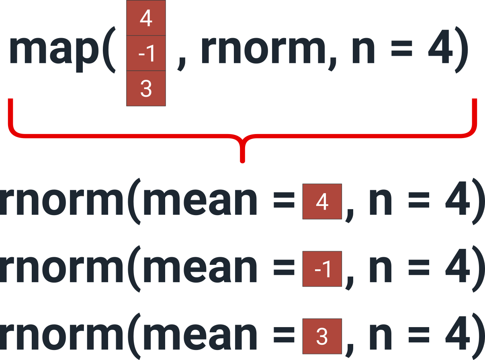
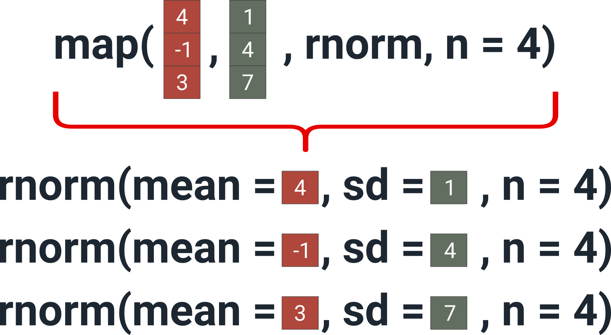
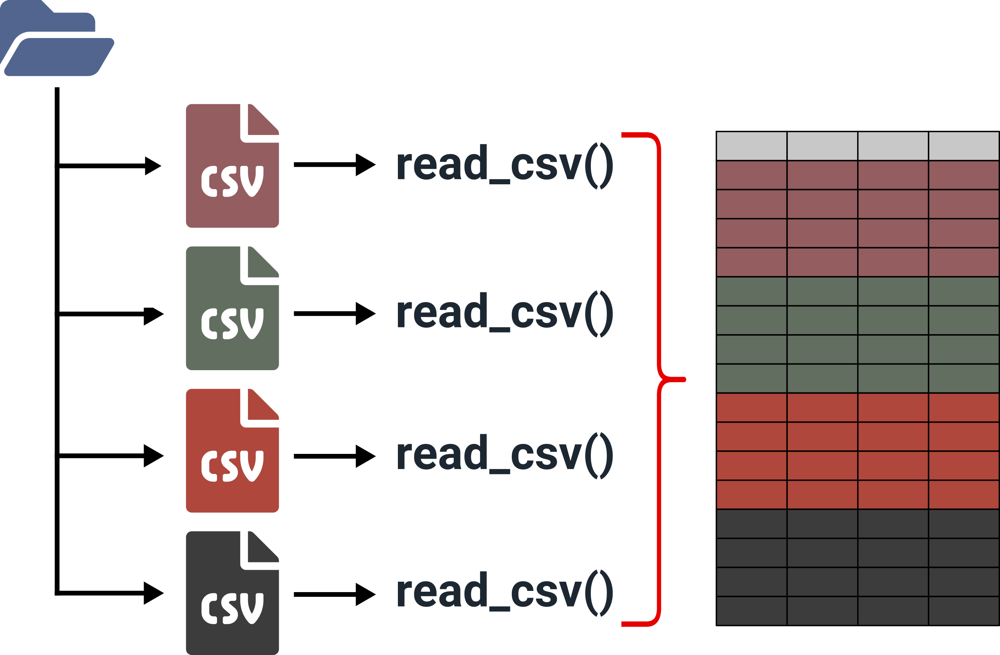
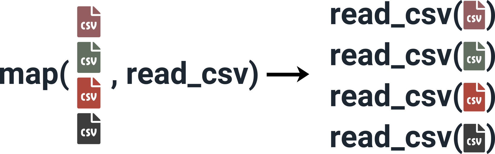

```{r setup, include=FALSE}
knitr::opts_chunk$set(echo = TRUE, dev = "svg", message = FALSE)
options(htmltools.dir.version = FALSE)
# names(xaringan:::list_css())

library(tidyverse)
library(extrafont)

## Set default ggplot2 font size and font familly

loadfonts(quiet = TRUE)
theme_set(theme_bw(base_size = 12, base_family = "IBM Plex Sans"))

htmltools::tagList(rmarkdown::html_dependency_font_awesome())
```

<br>

<center></center>

<p align="left">

<b>Assistant de recherche à Takuvik (télédétection, modélisation, data science)</b><br>

- Utilise R depuis plus de 8 ans<br>
- Auteur de 3 librairies sur CRAN<br>
- Blog R: www.pmassicotte.com<br>

<br>

<i class="fab fa-github"></i> https://github.com/PMassicotte <br>
<i class="far fa-envelope"></i> philippe.massicotte@takuvik.ulaval.ca <br>
<i class="fab fa-twitter"></i> @philmassicotte

</p>

---

class: inverse, center, middle

# Plan de la formation

---

## Plan de la formation

1. Mise en contexte
  * Les dangers de la duplication du code: une étude de cas

2. La programmation fonctionnelle
  * Opérations sur des vecteurs
  * Opérations sur des *data frame*

3. Présentation disponible à cette adresse: **http://www.pmassicotte.com/rquebec2019/**

4. Données pour les exercices: **https://bit.ly/2W3KJjw**
  * Théorie + exercices après chaque concept
  * **Votre participation est essentielle!**

---

## La manipulation de données

Dans plusieurs domaines, les données sont produites très rapidement:

- Environnement: capteurs automatisés (température, précipitation, etc.)
- Finances / assurances
- Transport: géolocalisation

La manipulation de ces données demande beaucoup de temps et le cycle doit souvent être répété.

<figure>
<center>

<figcaption>Source: https://moderndive.com/</figcaption>
</center>
</figure>

---

## La manipulation de données

Il est important d'apprendre et de mettre en pratique les outils essentiels pour **capturer**, **manipuler** et **partager** des données de manière efficace.

- Pourquoi est-ce important?

**Le 80%/20% du *data science***

> Most data scientists spend only 20 percent of their time on actual data analysis and 80 percent of their time finding, cleaning, and reorganizing huge amounts of data, which is an inefficient data strategy (https://bit.ly/2wjB8IB).

<br>
.content-box-blue[Autrement dit: la manipulation de données est une tâche répétitive et propice aux erreurs!]

---

class: inverse, center, middle

# Exemple de code répétitif

## Une étude de cas

---

## Répéter la même opération sur plusieurs colonnes

On veut normaliser chaque colonne de `df` de manière à ce que les données varient entre 0 et 1.

```{r}
set.seed(1234)

# Générer des données, 4 colonnes avec 10 observations
df <- data.frame(
  a = rnorm(10),
  b = rnorm(10),
  c = rnorm(10),
  d = rnorm(10)
)

df

```

---

## Répéter la même opération sur plusieurs colonnes

On veut normaliser chaque colonne de `df` de manière à ce que les données varient entre 0 et 1.

$$
\frac{x - \text{min}(x)}{\text{max}(x) - \text{min}(x)}
$$
On peut valider en générant un vecteur de 10 nombres et en appliquant l'opération mathématique:

```{r}
# Générer un vecteur de 10 nombres
set.seed(1234)
x <- sample(10)
x

# Normaliser les données
(x - min(x)) / (max(x) - min(x))

```

---

## Répéter la même opération sur plusieurs colonnes

Lorsque vous avez commencé à programmer, il y a de fortes chances que vous ayez procédé de la manière suivante: **répèter la même opération sur toutes les colonnes de `df`**.

```{r}
# Normaliser la colonne a
df$a <- (df$a - min(df$a, na.rm = TRUE)) / (max(df$a, na.rm = TRUE) - min(df$a, na.rm = TRUE))

# Normaliser la colonne b
df$b <- (df$b - min(df$b, na.rm = TRUE)) / (max(df$b, na.rm = TRUE) - min(df$b, na.rm = TRUE))

# Normaliser la colonne c
df$c <- (df$c - min(df$c, na.rm = TRUE)) / (max(df$c, na.rm = TRUE) - min(df$b, na.rm = TRUE))

# Normaliser la colonne d
df$d <- (df$d - min(df$d, na.rm = TRUE)) / (max(df$d, na.rm = TRUE) - min(df$d, na.rm = TRUE))

```

---

## Répéter la même opération sur plusieurs colonnes

Chaque colonne (vecteur) est maintenant entre 0-1.

```{r}
df
```

---

## Répéter la même opération sur plusieurs colonnes

Quel est le problème?

```{r, eval=FALSE}
df$a <- (df$a - min(df$a, na.rm = TRUE)) / (max(df$a, na.rm = TRUE) - min(df$a, na.rm = TRUE))
df$b <- (df$b - min(df$b, na.rm = TRUE)) / (max(df$b, na.rm = TRUE) - min(df$b, na.rm = TRUE))
df$c <- (df$c - min(df$c, na.rm = TRUE)) / (max(df$c, na.rm = TRUE) - min(df$b, na.rm = TRUE))
df$d <- (df$d - min(df$d, na.rm = TRUE)) / (max(df$d, na.rm = TRUE) - min(df$d, na.rm = TRUE))
```

--

Erreur de copié/collé!!!

```{r, eval=FALSE}
df$a <- (df$a - min(df$a, na.rm = TRUE)) / (max(df$a, na.rm = TRUE) - min(df$a, na.rm = TRUE))
df$b <- (df$b - min(df$b, na.rm = TRUE)) / (max(df$b, na.rm = TRUE) - min(df$b, na.rm = TRUE))
{{df$c <- (df$c - min(df$c, na.rm = TRUE)) / (max(df$c, na.rm = TRUE) - min(df$b, na.rm = TRUE))}}
df$d <- (df$d - min(df$d, na.rm = TRUE)) / (max(df$d, na.rm = TRUE) - min(df$d, na.rm = TRUE))
```

---

## Nombre raisonnable de répétitions

- L'approche DRY: **D**on't **R**epeate **Y**ourself

- Il est souvent dit que si vous avez 3 copies du même code, **il est temps d'écrire une fonction**.

<br>
<center>
<a href="https://imgflip.com/i/2y8ds5"></a>
</center>

---

## Répéter la même opération sur plusieurs colonnes

Une première amélioration: **utiliser une fonction**.

--

Étudier la formule de base:

```{r, eval=FALSE}
(`df$d` - min(`df$d`, na.rm = TRUE)) / (max(`df$d`, na.rm = TRUE) - min(`df$d`, na.rm = TRUE))
```

--

Paramétrer le code -> remplacer les variables par des arguments:

```{r, eval=FALSE}
(`x` - min(`x`, na.rm = TRUE)) / (max(`x`, na.rm = TRUE) - min(`x`, na.rm = TRUE))
```

--

Écrire une fonction :

```{r, eval=FALSE}
# Fonction qui prend un vecteur numerique "x" et qui scale les valeurs entre 0-1
scale_vector <- function(`x`) {
  
  res <- (`x` - min(`x`, na.rm = TRUE)) / (max(`x`, na.rm = TRUE) - min(`x`, na.rm = TRUE))
  
  return(res)
}
```

```{r, eval=TRUE, echo=FALSE}
# Fonction qui prend un vecteur numerique "x" et qui scale les valeurs entre 0-1
scale_vector <- function(x) {
  
  res <- (x - min(x, na.rm = TRUE)) / (max(x, na.rm = TRUE) - min(x, na.rm = TRUE))
  
  return(res)
}
```

---

## Tester notre fonction

```{r}
# Vecteur numérique
v <- c(0, 1, 45, 98, -5)
v

scale_vector(v)
```

--

<center>
<image src="https://media.giphy.com/media/8JW82ndaYfmNoYAekM/giphy.gif" height="300" frameBorder="0" class="giphy-embed" allowFullScreen></image>
</center>

---

## Utiliser la fonction sur le *data frame*

Maintenant que la fonction `scale_vector()` fonctionne, utilisons-là sur chacune des colonnes du *data frame*.

```{r}
df$a <- scale_vector(df$a)
df$b <- scale_vector(df$b)
df$c <- scale_vector(df$b)
df$d <- scale_vector(df$d)

df
```

---

## Déjà mieux!

L'utilisation de la fonction `scale_vector()` rend le code beaucoup plus simple.

```{r, eval=FALSE}
df$a <- scale_vector(df$a)
df$b <- scale_vector(df$b)
df$c <- scale_vector(df$b)
df$d <- scale_vector(df$d)
```

VS

```{r, eval=FALSE}
df$a <- (df$a - min(df$a, na.rm = TRUE)) / (max(df$a, na.rm = TRUE) - min(df$a, na.rm = TRUE))
df$b <- (df$b - min(df$b, na.rm = TRUE)) / (max(df$b, na.rm = TRUE) - min(df$b, na.rm = TRUE))
df$c <- (df$c - min(df$c, na.rm = TRUE)) / (max(df$c, na.rm = TRUE) - min(df$a, na.rm = TRUE))
df$d <- (df$d - min(df$d, na.rm = TRUE)) / (max(df$d, na.rm = TRUE) - min(df$d, na.rm = TRUE))
```

---

## Utiliser la fonction sur le *data frame*

Fonctionne très bien, mais il y a 4 répétitions.

```{r, eval=FALSE}
df$a <- scale_vector(df$a)
df$b <- scale_vector(df$b)
df$c <- scale_vector(df$b)
df$d <- scale_vector(df$d)
```

--

Toujours la possibilité de se tromper!

.pull-left[

```{r, eval=FALSE}
df$a <- scale_vector(df$a)
df$b <- scale_vector(df$b)
{{df$c <- scale_vector(df$b)}}
df$d <- scale_vector(df$d)
```
]

.pull-right[
<image src="https://media.giphy.com/media/l1KVaj5UcbHwrBMqI/giphy.gif" height="200"</image>
]

---

## Répéter la même opération sur plusieurs colonnes

Une deuxième amélioration: pourquoi ne pas **utiliser une boucle** qui permettrait de répéter l'opération plusieurs fois?

<center>
<image src="https://media.giphy.com/media/7XuPYJXaF1CBAmbwQQ/giphy.gif" width="480" height="360" frameBorder="0" class="giphy-embed" allowFullScreen></image>
</center>

---

class: inverse

## Exercice

.full-width[.content-box-gray[Écrivez une boucle qui permet de normaliser toutes les colonnes de `df`. Au lieu de `scale_vector()`, vous pouvez utiliser la fonction `scale(x, center = FALSE, scale = TRUE)` fournit avec R.]]

```{r}

scale_vector <- function(x) {
  res <- (x - min(x, na.rm = TRUE)) / 
    (max(x, na.rm = TRUE) - min(x, na.rm = TRUE))
  
  return(res)
}

set.seed(1234)

# Générer des données, 4 colonnes avec 10 observations
df <- data.frame(
  a = rnorm(10),
  b = rnorm(10),
  c = rnorm(10),
  d = rnorm(10)
)

```

---

## Problèmes potentiels des boucles

--

Il faut bien gérer les index utilisées, ce qui est propice aux erreurs lorsque plusieurs boucles sont imbriquées.

```{r, eval=FALSE}

for(i in seq_along(df1)) {
  
  for(j = seq_along(df2)) {
    {{df2[j, i] <- df[i, j]}}
  }
  
}
```

De plus, l'accent est mis sur *la mécanique de l'opération* plutôt que sur le résultat attendu.

---

class: inverse, center, middle

# Notes sur les boucles

*They are not the evil you might think*

---

## Rapidité des boucles

**Contrairement à l'idée reçue, les boucles en R ne sont pas nécessairement lentes.** La plupart du temps, la lenteur des boucles est liée au fait que la variable qui reçoit le résultat n'est pas initialisée.

Dans l'exemple suivant, on veut créer une boucle qui créer un vecteur de 1000 éléments avec les valeurs de 1 à 1000.

.pull-left[

**Boucle sans initialisation**

```{r}
f_slow <- function(n) {
  {{v <- NULL}}
  for (i in 1:n) 
    v <- c(v, i)
  
  return(v)
}

```
]

.pull-right[

**Boucle avec initialisation**

```{r}
f_fast <- function(n) {
  {{v <- vector(mode = "numeric", length = n)}}
  for (i in 1:n) 
    v[i] <- i
  
  return(v)
}
```

]

</br>
</br>

.content-box-blue[Il est important de **toujours** initialiser les vecteurs avant d'entrer dans une boucle.]

---

## Rapidité des boucles

Les boucles ne sont pas foncièrement lentes!

```{r, message=FALSE, echo=TRUE, fig.height=4, fig.align="center"}
# Calculer le temps d'exécution des deux fonctions/boucles
n <- 1000
timing <- microbenchmark::microbenchmark(f_slow(n), f_fast(n))
autoplot(timing)
```

---

## Rapidité des boucles

Les boucles ne sont pas foncièrement lentes! Evidemment, on aurait du utiliser:

```{r, eval=FALSE}
v <- 1:1000 # Méthode la plus rapide pour initialiser un vecteur
```

```{r, message=FALSE, echo=TRUE, fig.height=3, fig.align="center", warning=FALSE, cache=TRUE}
# Calculer le temps d'exécution des deux fonctions/boucles
n <- 1000
timing <- microbenchmark::microbenchmark(f_slow(n), f_fast(n), 1:n)
autoplot(timing)
```

---

class: inverse, center, middle

## La programmation fonctionnelle

#### Les boucles c'est bien, mais c'est encore mieux sans!


Advanced R (Chapman & Hall/CRC The R Series)

---

## La programmation fonctionnelle

> La programmation fonctionnelle est un paradigme de programmation de type déclaratif qui considère le calcul en tant qu'évaluation de fonctions mathématiques. (Wikipedia)

- La principale caractéristique de la programmation fonctionnelle est **que des fonctions sont passées en paramètre** à d'autres fonctions.

- Comparé à l'utilisation de l'approche *impérative*, l'accent est mis sur l'opération effectuée (*i.e. la fonction à appliquer*) et non sur la mécanique nécessaire pour naviguer au travers des éléments et sur comment enregistrer le résultat.

- Il y a de fortes chances que vous ayez déjà utilisé la fonction `lapply()`. 
  - La fonction `lapply()` est appelé **un fonctionnel**, car elle utilise une fonction comme paramètre.

---

## Avantages de la programmation fonctionnelle

1. Le code est plus compacte (plus facile à lire et comprendre).

2. Plus facile à maintenir: 
  * Lorsque vous créez une fonction pour une tâche répétée, il est facile de modifier cette fonction. Chaque emplacement de votre code où la même tâche est effectuée est automatiquement mis à jour.

3. Modularité: si vous écrivez une fonction pour des tâches individuelles spécifiques, vous pouvez les utiliser plusieurs fois. Une fonction que vous écrivez pour un script peut même être réutilisée dans d'autres scripts!

```{r, eval=FALSE}
scale_vector <- function(x) {
  
  res <- (x - min(x, na.rm = TRUE)) / (max(x, na.rm = TRUE) - min(x, na.rm = TRUE))
  
  return(res)
}
```

---

## *purrr*

- La librairie `purrr` offre plusieurs outils de programmation fonctionnelle.

- `purrr` n'est pas installé par défaut. L'installation de `tidyverse` inclut la librairie `purrr`.

```{r, eval=FALSE}
install.packages("tidyverse")
library(tidyverse)
```

<center></center>

---

class: inverse, center, middle

# Tidyverse

## Une série d'outils pour la manipulation de données

<center>

</center>

<center>
    
</center>

---

## La fonction `map()`

- La fonction `map()` de la librairie `purrr` est une version *pimpée* de `lapply()`.

- Elle permet **d'appliquer** une fonction `f()` à une liste d'éléments.

<br>

<center>

</center>

<small>Figure: https://adv-r.hadley.nz/functionals.html#map</small>

---

## La fonction `map()`

Dans ce premier exemple, on veux ajouter la valeur de 1 à tous les éléments d'un vecteur numérique.

```{r}
# Créer une fonction "f" qui prend un nombre et lui ajoute la valeur de 1.
f <- function(x) {
  x + 1
}

# "Appliquer" la fonction "f" au vecteur 1, 2, 3
map(.x = c(1, 2, 3), .f = f) # 1 + 1, 2 + 1, 3 + 1
```

<br>
.content-box-blue[Il est important de prendre note que la fonction `map()` retourne toujours une liste d'éléments.]

---

## La fonction `map()`

On aurait pu obtenir le même résultat en utilisant la fonction `lapply()` qui est inclut avec R:

```{r}
lapply(X = c(1, 2, 3), FUN = f)
```

Notez que l’utilisation de `map()` ou de `lapply()` dans ce cas-ci n'est pas très utile. On pourrait évidement reproduire le résultat en utilisant les capacités de vectorisation de R:

```{r}
x <- 1:3
x + 1
```

---

## La fonction `map()`

Dans ce deuxième exemple, on veut connaître la classe de chaque colonne du *data frame* `mtcars`.

```{r}
head(mtcars, 20) # Afficher les 20 premières lignes
```

---

## La fonction `map()`

Il est tentant de faire du copier/coller en utilisant la fonction `class()`:

```{r}
class(mtcars$mpg)
class(mtcars$cyl)
class(mtcars$disp)
```

---

## La fonction `map()`

Ou bien de faire une boucle:

```{r}
# Vecteur pour le résultat
res <- vector(mode = "character", length = ncol(mtcars))

# Faire une boucle sur toutes les colonnes de mtcars
for(i in seq_along(mtcars)) {
  res[i] <- class(mtcars[, i])
}

res
```

---

class: inverse, center, middle

## Exercice

.full-width[.content-box-gray[Utilisez la fonction `map()` pour extraire la classe de chacune des colonnes de `mtcars`.]]

```{r, eval=FALSE, echo=FALSE}
get_class <- function(x) {
  class(x)
}

map(mtcars, get_class)
map(mtcars, class)

```


---

## Les fonctions anonymes

Revenons à notre exemple qui ajoute la valeur 1 à un vecteur.

```{r, eval=FALSE}
# Créer une fonction "f" qui prend un nombre et lui ajoute la valeur de 1.
f <- function(x) {
  x + 1
}

# "Appliquer" la fonction "f" au vecteur 1, 2, 3
map(.x = c(1, 2, 3), .f = f)
```

- La fonction `f()` est très simple, on pourrait éviter de créer explicitement une fonction.

- Il est possible d'utiliser des **fonctions anonymes** quand ça ne vaut pas la peine de lui donner un nom.

---

## Les fonctions anonymes et formules

L'exemple précédent peut se ré-écrire en utilisant une fonction anonyme. Avec cette approche, nous n'avons pas besoin de fournir un nom de fonction.

```{r}
map(1:3, function(x) x + 1)
```

---

## Les fonctions anonymes et formules

On peut également utiliser l'approche par formule conjointement avec `~`. Ici on fait référence au paramètre en utilisant la notation `~.x`. 

```{r}
map(1:3, ~.x + 1) # 1 + 1, 2 + 1, 3 + 1
```

```{r}
map(1:3, ~log(.x)) # log(1), log(2), log(3)
```

---

class: inverse

## Exercice

```{r, echo=FALSE, warning=FALSE, message=FALSE}
df <- read_csv2("https://perso.telecom-paristech.fr/eagan/class/igr204/data/cars.csv")

df <- df[-1, ]

res <- map(df, parse_guess) %>% 
  as_tibble() %>% 
  janitor::clean_names()

# One NA in the data

res$mpg[10] <- NA

write_csv(res, "data/clean/cars.csv")

```

.full-width[.content-box-gray[Calculez la moyenne de chacune des colonnes de ce jeu de données en utilisant une fonction anonyme.]]

```{r, message=FALSE}
df <- read_csv("data/clean/cars.csv")
head(df, 3)

# Sélectionner seulement les colonnes numériques
df <- select_if(df, is.numeric)
```
<small>Données: https://perso.telecom-paristech.fr/eagan/class/igr204</small>

```{r, echo=FALSE, eval=FALSE}
map(df, function(y) mean(y))
```

---

## Utilisation des paramètres

Jusqu'à maintenant, nous avons invoqué l'appel de fonctions sans l'utilisation de paramètres. Il est possible de spécifier les valeurs de paramètres à fournir à la fonction en utilisant des **paramètres nommés** de la manière suivante: 

```{r, eval=FALSE}
map(list, function, param1 = xxx, param2 = yyy, param3 = zzz)
```

Exemple avec les données *cars*. On veut calculer la moyenne de chacune des colonnes numériques.

```{r, message=FALSE}
# library(tidyverse)
df <- read_csv("data/clean/cars.csv")
df <- select_if(df, is.numeric)
```

La fonction `mean()` a un paramètre `na.rm = FALSE` qui permet de spécifier si les `NA` doivent être incluent dans le calcul.

---

## Utilisation des paramètres

.pull-left[

```{r}
map(df, mean) 
```
]

.pull-right[
```{r}
{{map(df, mean, na.rm = TRUE)}}
```
]

---

## Les fonctions anonymes et formules: un résumé

Il y a trois façons différentes d'utiliser des fonctions anonymes avec `purrr`:

```{r, eval=FALSE}
y <- 1:3

map(y, function(x) log(x, base = 2)) # Avec fonction anonyme

map(y, ~log(.x, base = 2)) # Avec formule

map(y, log, base = 2)

```

---

## Les variantes de `map()`

Il existe plusieurs variantes de `map_*()` qui permettent **d'être explicite sur la classe retournée par la fonction**.

<br><br>

|   Fonction   |      Description      |   Exemples   |
| ------------ | --------------------- | ------------ |
| `map_dbl()`  | Vecteur de doubles    | 2.1, pi      |
| `map_int()`  | Vecteur d'entiers     | 1, 3         |
| `map_char()` | Vecteur de caractères | "R à Québec" |
| `map_lgl()`  | Vecteur de booléens   | TRUE, FALSE  |
| `map_df()`   | Liste de *data frame* |              |

---

## Les variantes de `map()`

Par exemple, on sait que la fonction `mean()` retourne une valeur numérique de type **double**. Dans ce cas, on peut utiliser la fonction `map_dbl()` pour calculer la valeur moyenne de chacune des colonnes de `mtcars`.

```{r}
# Appliquer la fonction "mean" à chacune des colonnes de mtcars
map_dbl(mtcars, mean) 
```

Il est intéressant de pouvoir être explicite sur la classe des données attendues. Dans le prochain cas, une erreur est générée, car la fonction `mean()` retourne une valeur de type *double* alors que je spécifie que je devrais reçevoir un *integer*.

```{r error=TRUE}
map_int(mtcars, mean)
```

---

## Les variantes de `map()`

On peut également avoir le résultat sous forme d'un *data frame*.

```{r}
map_df(mtcars, mean)
```

---

class: inverse

## Exercice (1/2)

.full-width[.content-box-gray[Séparez le jeu de données `mtcars` en fonction du nombre de cylindres. Utilisez une variante de la fonction `map_*()` pour connaitre le nombre d'observation de chaque groupe.]]

```{r}
res <- split(mtcars, mtcars$cyl)
```

```{r, echo=FALSE}
map(res, head, n = 2)
```


---

class: inverse

## Exercice (2/2)

.full-width[.content-box-gray[Séparez le jeu de données `mtcars` en fonction du nombre de cylindres. Pour chacun des groupes, faire un modèle linéaire `mpg` en fonction de `wt` (`lm(mpg ~ wt)`). Écrivez une fonction `fit()` pour faire le modèle linéaire.]]

```{r, eval=FALSE}
res <- split(mtcars, mtcars$cyl)

fit <- function(...) {
  ...
}

map(..., ...)

```

Interdiction de faire...

```{r, eval=FALSE}
mod1 <- lm(mpg ~ wt, data = subset(mtcars, cyl == 4))
mod2 <- lm(mpg ~ wt, data = subset(mtcars, cyl == 6))
mod3 <- lm(mpg ~ wt, data = subset(mtcars, cyl == 8))
```


```{r, echo=FALSE, eval=FALSE}

fit <- function(df) {
  
  lm(mpg ~ wt, data = df)
  
}

map(res, fit)

```

```{r, echo=FALSE, eval=FALSE}
# Version anonyme
map(res, function(df) lm(mpg ~ wt, data = df))
```

```{r, echo=FALSE, eval=FALSE}
# Version avec formule
map(res, ~lm(mpg ~ wt, data = .))
```

---

## Map sur plusieurs vecteurs/listes

Jusqu'ici, nous avons *mappé* avec une seule entrée (un seul vecteur ou une seule liste). Si vous avez plusieurs entrées, vous devez **parcourir en parallèle**. Pour ce faire, nous utiliserons les fonctions `map2()` et `pmap()`.

La fonction `map2()` permet de parcourir en parallèle deux **vecteurs/listes**. L'utilisation de base de `map2()` est similaire à `map()`.

```{r, eval=FALSE}
map2(.x, .y, .f, ...)

map2(INPUT_ONE, INPUT_TWO, FUNCTION_TO_APPLY, OPTIONAL_ARGUMENTS)
```

---

## Map sur plusieurs vecteurs/listes

Imaginons que nous voulions générer trois vecteurs de valeurs aléatoires à l'aide de la fonction `rnorm()`. Pour chaque génération, nous voulons spécifier une moyenne différente.

.pull-left[
```{r}
# Vecteur de moyennes
mu <- c(4, -1, 3)

map(mu, rnorm, n = 4)
```
]

.pull-right[

<center>

</center>

]

---

## Map sur plusieurs vecteurs/listes

Disons maintenant que nous voulions en plus spécifier une valeur d'écart-type différente pour chaque génération. Il faut spécifier un deuxième vecteur contenant les écart-types. Il faut alors utiliser la fonction `map2()`.

.pull-left[
```{r}
# Vecteur de moyennes
mu <- c(4, -1, 3)

# Vecteur d'écart-types
sigma <- c(1, 4, 7)

map2(.x = mu, .y = sigma, .f = rnorm, n = 4)
```
]

.pull-right[

<center>

</center>

]

---

## Map sur plusieurs vecteurs/listes

Comme avec la fonction `map()`, il y a plusieurs variantes de `map2_*()`.

```{r}
map2(c(1, 2, 3), c(4, 5, 6), sum) # 1 + 4, 2 + 5, 3 + 6

map2_dbl(c(1, 2, 3), c(4, 5, 6), sum) # Être explicite sur la classe des valeurs de retour
```

---

## Map sur plusieurs vecteurs/listes

Lorsqu'on utilise une fonction anonyme, on peut utiliser la notation `.x` et `.y` pour faire référence aux paramètres utilisés dans la fonction. Dans l'exemple suivant on veut concatener deux vecteurs de caractères.

```{r}
map2_chr(.x = c("a", "b", "c"), .y = c("x", "y", "z"), .f = ~paste(.x, .y, sep = "---"))
```

Dans ce cas, il y a eux trois itérations:

1. `.x = "a"` et `.y = "x"`
2. `.x = "b"` et `.y = "y"`
3. `.x = "c"` et `.y = "z"`

Ce qui est équivalent à:

```{r, eval=FALSE}
paste("a", "x", sep = "---")
paste("b", "y", sep = "---")
paste("c", "z", sep = "---")
```

---

## Map sur plusieurs vecteurs/listes

Maintenant, comment faire pour *mapper* sur plus de deux vecteurs/listes? La fonction `pmap()` (*parallel map*) permet d'itérer simultanément sur plusieurs vecteurs/listes.

```{r, eval=FALSE}
pmap(.l, .f, ...)

map2(LIST_INPUT, FUNCTION_TO_APPLY, OPTIONAL_ARGUMENTS)
```

---

## Map sur plusieurs vecteurs/listes

Dans cet exemple, on veut générer trois vecteurs aléatoires avec des moyennes, des écart-types et ce de longueurs différentes. Pour ce faire, il faut créer **une liste nommée** pour les paramètres.

```{r}
l <- list(
  mean = c(1, -200, 3), # Vecteur avec les 3 moyennes #<<
  sd = c(1, 2, 3), # Vecteur avec les 3 écart-types #<<
  n = c(1, 3, 6) # Vecteur avec les 3 longueurs de vecteurs #<<
)

l
```

---

## Map sur plusieurs vecteurs/listes

Maintenant on peut appeler la fonction `pmap()` avec la liste `l`.

```{r}
l <- list(
  mean = c(1, -200, 3), # Vecteur avec les 3 moyennes #<<
  sd = c(1, 2, 3), # Vecteur avec les 3 écart-types #<<
  n = c(1, 3, 6) # Vecteur avec les 3 longueurs de vecteurs #<<
)
```

```{r}
pmap(.l = l, .f = rnorm)
```

---

## Map sur plusieurs vecteurs/listes

Mais pourquoi cela fonctionne t'il? Comment les paramètres sont placés aux bons endroits? 

```{r, eval = FALSE}
l <- list(
  mean = c(1, -200, 3), # Vecteur avec les 3 moyennes #<<
  sd = c(1, 2, 3), # Vecteur avec les 3 écart-types #<<
  n = c(1, 3, 6) # Vecteur avec les 3 longueurs de vecteurs #<<
)
```

Regardons la structure de la fonction `rnorm()`.

```{r, eval=FALSE}
rnorm(n, mean = 0, sd = 1)
```

- Il faut comprendre que la fonction `rnorm()` s'attend à reçevoir dans l'ordre: `n`, `mean` et `sd`. 

- Cependant, l'ordre de la liste est plutôt: `mean`, `sd`, et `n`. 

- Puisque la liste `l` est nommée **avec les mêmes noms que les paramètres de `rnorm()`**, R va placer automatiquement les paramètres aux bons endroits.

---

## Toujours utiliser une liste nommée

.pull-left[

```{r}
set.seed(1234)
pmap(
  .l =
    list(
      mean = c(1, 5, 3), #<<
      sd = c(1, 2, 3), #<<
      n = c(1, 3, 2) #<<
    ),
  .f = rnorm
)
```

Equivalent à:

```{r, eval = FALSE}
rnorm(n = 1, mean = 1, sd = 1)
rnorm(n = 3, mean = 5, sd = 2)
rnorm(n = 2, mean = 3, sd = 3)
```
]

.pull-right[

```{r}
set.seed(1234)
pmap(
  .l =
    list(
      c(1, 5, 3), #<<
      c(1, 2, 3), #<<
      c(1, 3, 2)  #<<
    ),
  .f = rnorm
)
```

Equivalent à:

```{r, eval = FALSE}
rnorm(n = 1, mean = 1, sd = 1)
rnorm(n = 5, mean = 2, sd = 3)
rnorm(n = 3, mean = 3, sd = 2)
```
]

---

## Map sur plusieurs vecteurs/listes

Avec les fonctions `map()` et `map2()` on pouvait utiliser l'approche par *formule* en faisant référence aux paramètres en utilisant `.x` et `.y`.

Rappel: 

```{r, eval=FALSE}
# Avec 1 ou 2 entrées, on peut utiliser .x et .y
map2_chr(c("a", "b", "c"), c("x", "y", "z"), ~paste(.x, .y, sep = "---"))
```

Comment pouvons nous faire lorsqu'il y a plus de deux paramètres? Il suffit d'utiliser la notation `..1`, `..2`, `...n`.

```{r}
pmap_chr(
  list(
    c("a", "b", "c"), # ..1
    c("x", "y", "z"), # ..2
    c(1, 2, 3)        # ..3
  ),
  {{~ paste(..3, ..1, ..2, sep = "---")}}
)
```


---

class: inverse, center, middle

## Exercice pratique sur un cas réel

---

## Lire le contenu d'un répertoire

Une tâche courante consiste à lire plusieurs fichiers (CSV) dans un répertoire et de les combiner dans un seul *data frame*.

<center>

</center>

<small>Inspiré de: https://www.gerkelab.com/blog/2018/09/import-directory-csv-purrr-readr/ </small>

---

## Lire le contenu d'un répertoire

En utilisant l'approche fonctionnelle, il est très facile de lire une liste de fichiers contenus dans un répertoire.

</br>

<center>

</center>

---

## Étude de cas: *Capital bikeshare*

https://www.capitalbikeshare.com/

> Capital Bikeshare is metro DC's bikeshare service, with 4,300 bikes and 500+ stations across 6 jurisdictions: Washington, DC.; Arlington, VA; Alexandria, VA; Montgomery, MD; Prince George's County, MD; and Fairfax County, VA. Designed for quick trips with convenience in mind, it's a fun and affordable way to get around.

Similaire au système Bixi à Montréal.

<center>

</center>

---

## Les données

- Les statistiques sur l'utilisation des vélos pour l'année 2018 sont dans 12 fichiers différents (1 par mois).

- Données: https://s3.amazonaws.com/capitalbikeshare-data/index.html

- Plus de 3 500 000 lignes/observations (réduit de 90% pour les exercices suivants).

- Exemple pour le mois de janvier 2018.

```{r, echo=FALSE, message=FALSE, cache=TRUE, cache.extra = file.info("data/clean/capitale_bikeshare/201801_capitalbikeshare_tripdata.csv")}
read_csv("data/clean/capitale_bikeshare/201801_capitalbikeshare_tripdata.csv") %>% 
  arrange(start_date) %>% 
  glimpse()

```

---

```{r, cache=TRUE, echo=FALSE, warning=FALSE, fig.align='center', fig.width=10, fig.height=9, dev='CairoPNG'}
files <- list.files("data/clean/capitale_bikeshare/", full.names = TRUE)

df <- files %>% 
  map_df(read_csv)

coords <- read_csv("data/raw/Capital_Bike_Share_Locations.csv") %>% 
  janitor::clean_names() %>% 
  select(terminal_number, longitude, latitude)

df <- coords %>% 
  rename(longitude_start = longitude, latitude_start = latitude) %>% 
  right_join(df, by = c("terminal_number" = "start_station_number"))

df <- coords %>% 
  rename(longitude_end = longitude, latitude_end = latitude) %>% 
  right_join(df, by = c("terminal_number" = "end_station_number"))

library(ggmap)

qmplot(longitude, latitude, data = coords, maptype = "toner-lite", color = I("red"), size = I(0.5)) +
  geom_segment(data = df %>% sample_frac(0.1), aes(x = longitude_start, y = latitude_start, xend = longitude_end, yend = latitude_end), size = 0.5, alpha = 0.1, inherit.aes = FALSE) +
  geom_point(data = coords, aes(x = longitude, y = latitude), color = "red", inherit.aes = FALSE, size = 0.5)
```

---

## Les données

```{r, echo=FALSE, fig.height=4, fig.align='center', cache=TRUE, cache.extra = file.info("data/clean/capitale_bikeshare/201801_capitalbikeshare_tripdata.csv")}

# df <- read_csv("data/clean/capitale_bikeshare/201809-capitalbikeshare-tripdata.csv")

files <- list.files("data/clean/capitale_bikeshare/", full.names = TRUE)
df <- map_df(files, read_csv, col_types = cols())

df %>% 
  mutate(wday = lubridate::wday(start_date, label = TRUE)) %>% 
  filter(wday %in% c("Sun", "Sat")) %>% 
  mutate(month = lubridate::month(start_date, label = TRUE)) %>% 
  mutate(hour = lubridate::hour(start_date)) %>% 
  count(month, member_type) %>% 
  ggplot(aes(x = month, y = n, fill = member_type)) +
  geom_col() +
  xlab(NULL) +
  ylab("Nombre total de voyage") +
  # theme_solarized() +
  theme(legend.title = element_blank()) +
  labs(caption = "Data source: https://s3.amazonaws.com/capitalbikeshare-data/index.html") +
  labs(title = "Nombre de voyage par mois en 2018") +
  scale_fill_brewer(palette = "Set2")
```

---

## Les données

```{r, echo=FALSE, fig.height=4, fig.align='center', cache=TRUE}
df <- read_csv("data/clean/capitale_bikeshare/201809-capitalbikeshare-tripdata.csv")

files <- list.files("data/clean/capitale_bikeshare/", full.names = TRUE)
df <- map_df(files, read_csv, col_types = cols())

df %>% 
  group_by(wday = lubridate::wday(start_date, label = TRUE)) %>% 
  summarise(mean_duration = mean(duration), sd_duration = sd(duration)) %>% 
  ggplot(aes(x = wday, y = mean_duration / 60)) +
  geom_col() +
  xlab(NULL) +
  ylab("Durée moyen de l'emprunt (minutes)") +
  labs(caption = "Data source: https://s3.amazonaws.com/capitalbikeshare-data/index.html") +
  labs(title = "Temps d'emprunt moyen par jour en 2018")
```

---

class: inverse

## Exercice

.full-width[.content-box-gray[Utilisez la fonction `map_df()` pour lire et combiner tous les fichiers *captial bikeshare*.]]

```{r}
# Utiliser la fonction "list.files" pour lister tous les fichiers d'un répertoire
files <- list.files("data/clean/capitale_bikeshare/", full.names = TRUE)
files

# Completez avec votre code pour lire et combiner tous les fichiers

```

---

class: inverse

## Exercice

.full-width[.content-box-gray[Créez une fonction qui **(1)** ouvre chaque fichier et **(2)** qui calcule la moyenne de la variable/colonne `duration`.]]

```{r}
# Utiliser la fonction "list.files" pour lister tous les fichiers d'un répertoire
files <- list.files("data/clean/capitale_bikeshare/", full.names = TRUE)

# Completez avec votre code
```

---

## Note sur la lecture de fichiers

Je vous conseil fortement d'utiliser la fonction `read_csv()` de la librairie `readr` (inclut avec `tidyverse`) pour lire vos fichiers, car beaucoup plus rapide que `read.csv()`.

```{R, message=FALSE, echo=TRUE, fig.height=2.5, fig.width = 7, fig.align="center", cache=TRUE}
file <- "data/clean/capitale_bikeshare/201801_capitalbikeshare_tripdata.csv"

res <- microbenchmark::microbenchmark(
  read.csv = read.csv(file),
  read_csv =read_csv(file, col_types = cols()),
  fread = data.table::fread(file),
  times = 50
)

autoplot(res)

```

---

class: inverse, center, middle

# Peut-on aller plus loin?

## Programmation parallèle avec `furrr`

---

## Librairie `furrr`

```{r eval=FALSE, message=FALSE, warning=FALSE}
# Installer la librairie
install.packages("furrr")
```

- Le but de `furrr` est de simplifier la combinaison de la famille de fonctions de mappage de `purrr` et des capacités de traitement parallèle.

- Les fonctions de `furrr` débutent toutes par `future_*()` et peuvent remplacer pratiquement les utilisations de `map_*()`.

```{r, echo=FALSE}
library(furrr)
ls("package:furrr") %>% 
  .[grepl("^future_",.)] %>% 
  head(20)
```

---

## Parallélisation

```{r, message=FALSE, cache=TRUE}
library(furrr)
{{availableCores()}}

{{plan(multicore(workers = availableCores() - 1))}} # Utilise 7 coeurs

files <- list.files("data/clean/capitale_bikeshare/", full.names = TRUE)

df <- future_map_dfr(files, read_csv)

glimpse(df)

```

---

class: inverse, center, middle

# Programmation fonctionnelle sur les *data frame*

---

## Programmation fonctionnelle sur les *data frame*

- Jusqu'à maintenant, à l'exception de `map_df()`, nous avons utilisé les fonctions `map_*()` qui retourne des vecteurs.

- Il existe également plusieurs fonctions pour utiliser l'approche fonctionnelle sur des *data frame*.

- La plupart des fonctions que nous verrons aujourd'hui proviennent de la librairie `dplyr`.

<center>

</center>

- `dplyr` est inclut dans la librairie `tidyverse`.

```{r, eval=FALSE}
library(tidyverse)
```

---

## Retour sur l'exercice précédent

Dans un exercice précédent, nous devions calculer la moyenne de la colonne `duration` pour chaque mois de 2018. Disons maintenant que nous voulons calculer la moyenne de toutes les colonnes numériques.

```{r, message=FALSE, cache=TRUE}
files <- list.files("data/clean/capitale_bikeshare/", full.names = TRUE)

calculate_mean <- function(file) {
  df <- read_csv(file) # Ouvrir le fichier

  l <- list(
    mean_duration = mean(df$duration),
    mean_start_station_number = mean(df$start_station_number),
    mean_end_station_number = mean(df$end_station_number)
  )

  return(l)
}

```

---

## Retour sur l'exercice précédent

```{r, message=FALSE, cache=TRUE}
res <- map(files, calculate_mean)
head(res, 1)
```


**Cette approche fonctionne bien, mais:**

1. Il est impossible de savoir à quel mois correspond chacune des valeurs du vecteur.

2. Le code devra être modifié si une nouvelle colonne numérique est ajoutée dans les fichiers csv.

---

## La fonction `summarise()`

- La fonction `summarise()` permet de *compresser* un *data frame* en lui **appliquant une fonction** qui réduit le nombre d'observations.

- Par exemple, on peut calculer la valeur moyenne de `duration` pour les données de janvier 2018.

```{r, message = FALSE}
df <- read_csv("data/clean/capitale_bikeshare/201801_capitalbikeshare_tripdata.csv")

summarise(df, mean(duration))
```

Il est mieux de spéficier le nom de la nouvelle colonne à créer:

```{r}
summarise(df, mean_duration = mean(duration))
```


---

## La fonction `summarise_if()`

- La fonction `summarise_if()` est une variante de `summarise()` qui permet d'appliquer une fonction à un ensemble de colonnes qui répondent à une ou des condition(s).

- La fonction `summarise_if()` s'utilise comme suit:

```{r, eval = FALSE}
summarise_if(.tbl, .predicate, .funs, ...)
```

Où:

- `.tbl` est un *data frame*.

- `.predicate` une fonction qui retourne `TRUE/FALSE`.

- `.funs` une liste de fonctions à appliquer.

---

## La fonction `summarise_if()`

On peux maintenant utilise la fonction `summarise_if()` sur nos données.

```{r}
df <- read_csv("data/clean/capitale_bikeshare/201801_capitalbikeshare_tripdata.csv")

# On applique la fonction "mean" à toutes les colonnes de type "numeric" du data frame "df"
summarise_if(.tbl = df, .predicate = is.numeric, .funs = mean)
```

--

Ne célébrons pas trop vite! N'oubliez pas qu'on voulait faire ce calcule pour chacun des mois de l'année 2018.

<center>
<image src="https://media.giphy.com/media/OWJILXs8QpyiA/giphy.gif" height="200" frameBorder="0" class="giphy-embed" allowFullScreen></image>
</center>

---

## La fonction `group_by()`

- La fonction `group_by()` peut s'utiliser conjointement avec la fonction `summarise()` pour appliquer un calcule à un ensemble de groupes dans un *data frame*.

- - La fonction `group_by()` **prépare** un *data frame* a être utilisé par la fonction `summarise()`.

- La fonction `group_by()` s'utilise comme suit:

```{r, eval = FALSE}
group_by(.data, ...)
```

Où:

- `.data` est un *data frame*.

- `...` est une liste de colonne à utiliser pour effectuer le regroupement.

---

## La fonction `group_by()`

Par exemple, grouper `mtcars` sur la base de la colonne `cyl` (nombre de cylindres).  Le résultat renvoyé nous indique qu'il y a trois groupes de `cyl` dans le *data frame*.

```{r}
group_by(mtcars, cyl)
```

---

## Calculer les moyennes mensuelles

Calculer **les moyennes mensuelles** de toutes les colonnes numériques, en utilisant toutes les données de *bikeshare*. On peut diviser ce problème en trois étapes:

1. Lire tous les fichiers.

2. Grouper les données par mois.

3. Calculer la moyenne de chacune des colonnes de type numérique.

---

## Calculer les moyennes mensuelles

```{r, cache=TRUE}
# Étape 1: Lire tous les fichiers
files <- list.files("data/clean/capitale_bikeshare/", full.names = TRUE)
df <- map_df(.x = files, .f = read_csv)

# Ajouter la colonne mois dans le data frame
df$month <- format(x = df$start_date, "%b")

# Étape 2: Grouper les données par mois.
df <- group_by(.data = df, month)

# Étape 3: Calculer la moyenne de chacune des colonnes de type numérique.
df <- summarise_if(.tbl = df, .predicate = is.numeric, .funs = mean)

head(df) # Afficher les 6 premières lignes
```


---

class: inverse, center, middle

## L'opérateur pipe ` %>% `

<center></center>

---

## L'opérateur pipe ` %>% `

- L'opérateur pipe, `%>%`, permet d'enchaîner les opérations en passant le résultat d'un fonction comme premier argument dans la fonction suivante. Ce qui est très utile lorsqu'on a pas besoin des résultats intermédiaires.

- Lorsque vous voyez `%>%`, vous devriez vous dire **ensuite**.

- Implémenté dans la librairie `magrittr` (https://cran.r-project.org/web/packages/magrittr/vignettes/magrittr.html) et inclut avec `tidyverse`.

<center></center>

---

## L'opérateur pipe ` %>% `

Les deux commandes suivantes sont équivalentes:

```{r}
3 %>% log()
log(3)

```

Par défaut, ` %>% ` passe le paramètre à la première position de la fonction suivante. On peut cependant contrôler ce comportement en utilisant le point `.` pour explicitement spécifier où doit aller le paramètre.

Ces deux lignes sont équivalentes:

```{r, eval = FALSE}
2 %>% rnorm(n = 10, mean = .)

rnorm(n = 10, mean = 2)
```
---

## La version compacte

.pull-left[

```{r, cache = TRUE}
files <- list.files(
  "data/clean/capitale_bikeshare/",
  full.names = TRUE
)

files %>%
  map_df(read_csv) %>%
  group_by(
    month = format(start_date, "%b")
  ) %>%
  summarise_if(is.numeric, mean)
```
]

--

.pull-right[

<center>
<image src="https://media.giphy.com/media/iI6eeGjwScTCM/giphy.gif" height="300" frameBorder="0" class="giphy-embed" allowFullScreen></image>
</center>

]

---

## Appliquer plusieurs fonctions

Il est possible d'appliquer plus d'une fonction en utilisant le paramètre `.funs` avec une liste nommée de fonctions à utiliser.

```{r, cache=TRUE}
files %>%
  map_df(read_csv) %>%
  group_by(
    month = lubridate::month(start_date, label = TRUE)
  ) %>%
  summarise_if(is.numeric, .funs = list(mymean = mean, mysd = sd)) %>% #<<
  glimpse() # La fonction glimpse() est une version pimpée de str()
```

---

class: inverse

## À vous de jouer!

.full-width[.content-box-gray[Utiliser les concepts vu aujourd'hui pour reproduire le graphique suivant. Il s'agit de calculer la moyenne de la variable `duration` par heure et ce pour chaque mois de l'année.]]

```{r, echo=FALSE, fig.width=5, fig.height=3, fig.align='center', cache=TRUE}
files <- list.files("data/clean/capitale_bikeshare/", full.names = TRUE)

df <- files %>% 
  map_df(read_csv) %>% 
  group_by(month = lubridate::month(start_date, label = TRUE), hour = lubridate::hour(start_date)) %>% 
  summarise(mean_duration = mean(duration))

df %>% 
  ggplot(aes(x = hour, y = mean_duration / 60, color = factor(month))) +
  geom_line() +
  xlab("Heure de la journée") +
  ylab("Emprunt moyen (minutes)") +
  guides(color = guide_legend(ncol = 2)) +
  labs(color = NULL)

```

---

## La fonction `nest()`

La fonction `nest()` permet de créer une liste de *data frame* à l'intérieur d'un *data frame*. Cette fonction est généralement utilisée conjointement avec `group_by()`.

```{r}
head(mtcars)

mtcars %>% 
  group_by(cyl) %>% # Grouper selon la variable "cyl"
  nest() # "Compresser" le data frame, par défault, la nouvelle colonne se nomme "data"
```

---

## La fonction `unnest()`

La fonction `unnest()` de décompresser un *data frame* qui a été compressé avec `nest()`.

```{r, warning=FALSE}
mtcars %>% 
  group_by(cyl) %>% # Grouper selon la variable "cyl"
  nest() %>% # "Compresser" le data frame, par défault, la nouvelle colonne se nomme "data"
  unnest() # "Décompresser" le data frame
```

---

## La fonction `nest()`

En combinant les fonctions `nest()` et `map()`, il est possible de rapidement créer un modèle linéaire pour chacun des groupes.

```{r}
mtcars %>% 
  group_by(cyl) %>% 
  nest() %>% 
  mutate(mod = map(data, ~lm(mpg ~ wt, data = .))) #<<
```

La *data frame* contient maintenant:

- La ou les variables de regroupement.
- Les données compressées (colonne `data`).
- Les modèles linéaires (colonne `mod`).

**Les risques d'erreurs sont de beaucoup diminués, car tout est encapsulé dans un *data frame*.**

---

## La librairie `broom`

La librairie `broom` permet de convertir des objets statistiques en *data frame*.

```{r}
mtcars %>% 
  group_by(cyl) %>% 
  nest() %>% 
  mutate(mod = map(data, ~lm(mpg ~ wt, data = .))) %>% 
  mutate(coef = map(mod, broom::tidy)) %>% #<<
  unnest(coef)
```

---

class: inverse

## À vous de jouer!

.full-width[.content-box-gray[En utilisant le jeu de données `cars`, créer un modèle linéaire multiple (`mpg ~ horsepower + weight`) pour les `model` de chaque année. Par la suite, ajouter une colonne dans le *data frame* qui contient le R2 de la régression.]]

```{r}
cars <- read_csv("data/clean/cars.csv")
cars
```

---

## Les données

```{r, fig.align="center", echo=FALSE, warning=FALSE, fig.height=5}
cars %>% 
  ggplot(aes(x = horsepower, y = mpg)) +
  geom_point() +
  geom_smooth(method = "lm") +
  facet_wrap(~model, scales = "free")
```


```{r, echo=FALSE, eval=FALSE}
select_if(cars, is.numeric) %>% 
  languageR::pairscor.fnc()

cars %>% 
  group_by(model) %>% 
  nest() %>% 
  mutate(mod = map(data, ~lm(mpg ~ horsepower + weight, data = .))) %>% 
  mutate(summary = map(mod, summary)) %>% 
  mutate(r2 = map_dbl(r2, "r.squared"))
```

---

## Conclusions

- R est un langage de programmation fonctionnelle qui permet de faire beaucoup de chose rapidement et de manière élégante.

- La programmation fonctionnelle permet de diminuer les chances d'erreurs dans le code.
  - Si erreur, plus facilement corrigeable, car on modifie à un seul endroit.
  
- La librairie `purrr` offre un ensemble d'outils qui permet d'appliquer efficacement plusieurs concepts de la programmation fonctionnelle.

- L'utilisation de `nest()` permet d'encapsuler les résultats dans un *data frame* ce qui permet de les faire suivre tout au long du processus d'analyse.

---

## Merci!

Merci au comité organisateur de R à Québec 2019!

<center>
<image src="images/comite.bmp" height="400", align="middle"</image><image src="https://upload.wikimedia.org/wikipedia/commons/thumb/1/1b/R_logo.svg/724px-R_logo.svg.png" height="100", align="middle"</image><image src="images/logo_r_a_quebec_2019.png" height="100", align="middle"</image>
</center>

---

## Références

Beaucoup de matériel présenté dans cette classe provient de ressources en ligne. Merci à tout ceux et celles à qui j'ai piqué du code!!!

- https://bit.ly/2wjB8IB
- https://adv-r.hadley.nz/functionals.html#map
- https://www.r-exercises.com/2018/01/12/functional-programming-with-purrr-exercises-part-1/
- https://jennybc.github.io/purrr-tutorial/ls03_map-function-syntax.html
- https://sebastiansauer.github.io/multiple-lm-purrr2/
- https://nicercode.github.io/intro/repeating-things.html
- https://www.earthdatascience.org/courses/earth-analytics/automate-science-workflows/write-efficient-code-for-science-r/